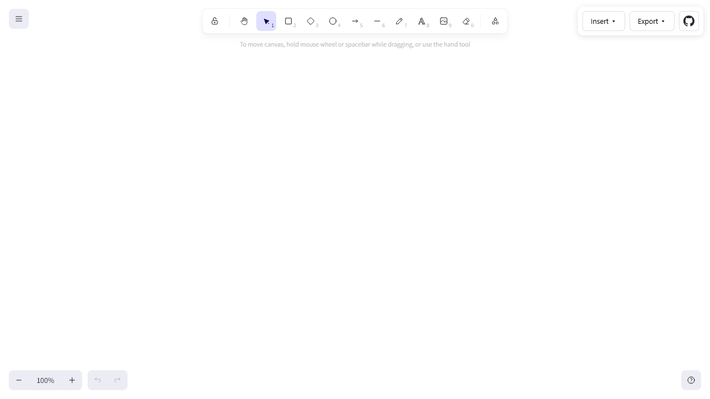

# draw.marcopontili.com

[](https://github.com/marcop135/draw/actions/workflows/ci.yml)




A free, open-source whiteboard at **https://draw.marcopontili.com**.

**What this is:** a static, privacy-first SPA on top of [Excalidraw](https://github.com/excalidraw/excalidraw)—extra insert paths (LaTeX, Mermaid, Markdown) behind explicit sanitization, strict CSP, self-hosted fonts, FTP-based production deploy. No accounts, no server-side state; good fit if you care how untrusted rich text becomes pixels.

- **LaTeX** — type math, get a vector image on the canvas (powered by [KaTeX](https://katex.org/)).
- **Mermaid** — paste a flowchart, get native, editable Excalidraw shapes (via [`@excalidraw/mermaid-to-excalidraw`](https://github.com/excalidraw/mermaid-to-excalidraw)).
- **Markdown** — type Markdown, get a sanitized vector note on the canvas.
- **Export** — PNG, JPEG, SVG, and PDF download.
- **No login. No backend. No tracking.** Drawings live only in your browser's `localStorage` (Excalidraw's default).

## Architecture (one paragraph)

Pure static SPA: React + TypeScript built with Vite 6. The browser tab `<title>`
and PWA manifest `name` follow [`SITE_DOCUMENT_TITLE`](./src/siteMeta.ts) (aligned
with the README heading); [`documentTitleGuard`](./src/lib/documentTitleGuard.ts)
resets `document.title` if Excalidraw overwrites it, while the launcher **short_name**
remains **`draw`** ([`SITE_SHORT_NAME`](./src/siteMeta.ts)). The whole app is bundled
into `dist/` and FTP-synced to a shared host. Excalidraw fonts are copied into
`dist/fonts/` at build time and `window.EXCALIDRAW_ASSET_PATH` points at the
site root, so no runtime CDN calls are made — keeps the CSP `default-src 'self'`
honest. All "Insert" inputs (LaTeX, Mermaid, Markdown) are sandboxed: KaTeX
runs with `trust: false` and `strict: "error"`; Markdown is run through
`DOMPurify` before it ever lands in the DOM or in the inserted SVG;
Mermaid input is parsed into shape primitives by the official
`mermaid-to-excalidraw` parser, never injected as HTML.

## Develop

```bash
nvm use            # node 20
npm ci
npm run dev        # http://localhost:5173
```

## Test

```bash
npm ci             # installs deps; postinstall fetches Chromium (skipped when CI=true or GITHUB_ACTIONS=true)
npm run test       # Vitest (DOMPurify policy, KaTeX options, Mermaid parse stub)
npm run test:watch

# Skip browser download when needed:
# PLAYWRIGHT_SKIP_BROWSER_DOWNLOAD=1 npm ci

npm run build
npm run test:e2e   # Chromium smoke: app shell + title
```

CI (`main` pushes and PRs) runs lint, production build, Vitest, then Playwright (`chromium` with `--with-deps` — postinstall intentionally skips browsers there).

## Build & preview production bundle

```bash
npm run build
npm run preview
```

Output lands in `dist/`, including `dist/.htaccess` (security headers + caching
for Apache hosts) and `dist/fonts/` (Excalidraw fonts copied from the package).

## Deploy

`.github/workflows/deploy.yml` runs **manually** (Actions → **Run workflow**). It runs
lint → build → FTP-sync `dist/` to the host document root (`protocol: ftps`; see workflow
comments if you need loose vs strict TLS for your provider).

Required GitHub Actions secrets:

| Secret | Used as |
|---|---|
| `FTP_HOST` | `server` |
| `FTP_USERNAME_PRODUCTION` | `username` |
| `FTP_PASSWORD_PRODUCTION` | `password` |

## Security model

- No backend, no auth, no PII, no DB → no server-side attack surface.
- CSP locked to `'self'` for scripts/styles/fonts/connections; `frame-ancestors 'none'`; `object-src 'none'`. Set via `dist/.htaccess`.
- All third-party-shaped inputs (LaTeX, Mermaid, Markdown) are sanitized before rendering. See `src/lib/latex.ts`, `src/lib/markdown.ts`, `src/lib/mermaid.ts`.
- Drawings persist in browser `localStorage` only — clearing site data wipes them. There is no cloud save and no shared collaboration server.

If you think you found an exploitable flaw, see [SECURITY.md](./SECURITY.md).

## Tech

- Excalidraw (drawing engine)
- React 18 + TypeScript
- Vite 6 (bundler)
- KaTeX (math rendering)
- marked + DOMPurify (Markdown rendering, sanitized)
- jsPDF (PDF wrapping)

## Acknowledgements

This project is **not** a fork of [realdennis/md2pdf](https://github.com/realdennis/md2pdf). **md2pdf** is an offline **Markdown → PDF** web tool (pick a `.md`, edit, print/save PDF). Thanks to [@realdennis](https://github.com/realdennis) for publishing that tooling; it provided a proven **FTP + GitHub Actions** deploy pattern used as a starting point here.

Compared to **md2pdf** in plain terms:

- **Purpose:** Markdown-centric conversion vs **Excalidraw** sketching canvas with Markdown as **one insert path** alongside LaTeX and Mermaid.
- **Core engine:** Built on **`@excalidraw/excalidraw`** (drawing, undo, persistence, PNG/SVG/export, `.excalidraw` scene), not a single markdown preview + print pipeline.
- **Extras here:** KaTeX math inserts, **`mermaid-to-excalidraw`**, sanitized Markdown-to-SVG snippets, tighter **CSP/headers** story for the deployed host and PWA/offline tooling.

Upstream drawing work lives with [Excalidraw](https://github.com/excalidraw/excalidraw)—see repo text above.

## License

MIT — see [LICENSE](./LICENSE).

## Images

Banner (illustration): [`docs/readme-banner.png`](./docs/readme-banner.png) — synced to **`public/social-preview.png`** on every `npm run build` for Open Graph.

Screenshot (live UI): regenerate with **`npm run capture:readme`** after installing Playwright Chromium — writes **`docs/app-screenshot.png`**.

Upload **`docs/readme-banner.png`** in **Settings → General → Social preview** so GitHub repo links use the same art as the banner above.
