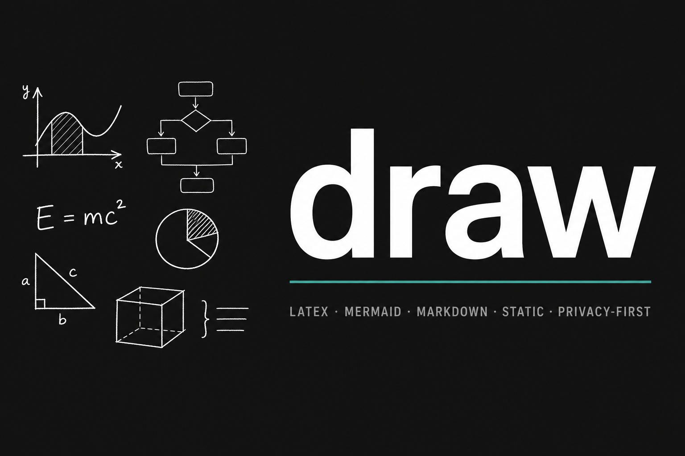
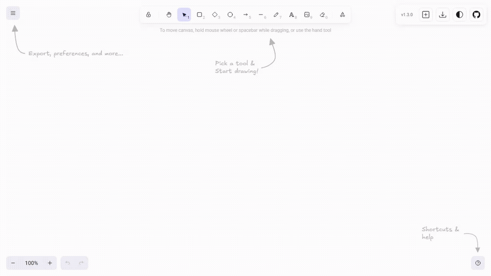

# draw

<p align="center">
  
</p>

<p align="center">
  
</p>

Live app: https://draw.marcopontili.com

Excalidraw whiteboard with LaTeX, Mermaid, and Markdown inserts. Local-first PWA, no backend, no login.

## Features

- Full **Excalidraw** sketching (drawing, selection, themes, load/save scene, undo)
- **LaTeX** math, **Mermaid** diagrams as native editable shapes, sanitized **Markdown** notes
- **Export** to `.excalidraw`, PNG, JPEG, SVG, PDF
- **PWA**: installable; Workbox precaches shell and assets for offline use

## Tech stack

- **React 18** and **TypeScript** with **Vite 6**
- **@excalidraw/excalidraw**
- **KaTeX**, **@excalidraw/mermaid-to-excalidraw**, **marked**, **DOMPurify**, **jsPDF**
- **vite-plugin-pwa** (Workbox) for the service worker
- **Vitest** and **Playwright** for automated tests

## Security

- **Local-first**: drawings live in browser `localStorage`; clearing site data wipes them
- **Sandboxed inserts**: KaTeX strict mode, Markdown through DOMPurify, Mermaid parsed to shapes (not raw HTML)
- **HTTP hardening**: CSP and related headers shipped in `dist/.htaccess`

See [SECURITY.md](./SECURITY.md) for vulnerability reports.

## Installation

Requires Node 20.

```bash
git clone https://github.com/marcop135/draw.git
cd draw
nvm use
npm ci
npm run dev      # http://localhost:5173
npm run build    # production output in dist/
```

## Usage

- **Insert** menu (floating toolbar): add **LaTeX**, **Mermaid**, or **Markdown**.
- **Export** menu: download **PNG**, **JPEG**, **SVG**, **PDF**, or **`.excalidraw`**.
- **Excalidraw** menu (hamburger): theme, background, **Load** scene, defaults.

## Project structure

| Path | Description |
| --- | --- |
| `src/` | React app: `App.tsx`, components, `lib/` helpers |
| `src/lib/` | Export, LaTeX, Markdown, Mermaid adapters |
| `src/components/` | Insert and export menus, modals, GitHub repo link |
| `public/` | Static assets, `robots.txt`, Apache `public/.htaccess` template |
| `e2e/` | Playwright tests (smoke plus optional readme artefact specs) |
| `dist/` | Production output after `npm run build` |

## Scripts

| Command | Description |
| --- | --- |
| `npm run dev` | Vite dev server |
| `npm run build` | Typecheck and production build |
| `npm run preview` | Preview `dist/` locally |
| `npm run test` | Vitest unit tests |
| `npm run test:e2e` | Playwright smoke suite |
| `npm run lint` | ESLint |

## 🤝 Contributing

Contributions welcome! CI runs lint, production build, Vitest, and Playwright smoke tests on `main` and PRs.

- 🐛 Found a bug? [Open an issue](https://github.com/marcop135/draw/issues)
- 💡 Have a feature request? [Open an issue](https://github.com/marcop135/draw/issues)
- 📝 Want to contribute? Fork the repo and open a PR

## 👤 Author

[Marco Pontili](https://marcopontili.com)

## 📝 License

Licensed under the [MIT](./LICENSE) License.
