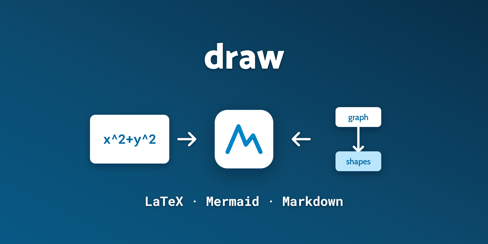

# draw

[](https://github.com/marcop135/draw/actions/workflows/ci.yml)
[](./LICENSE)
[](./CHANGELOG.md)

Personal whiteboard at [draw.marcopontili.com](https://draw.marcopontili.com). Excalidraw with LaTeX and Markdown inserts, native Mermaid diagrams, system light/dark theme, and PNG/JPEG/SVG/PDF/`.excalidraw` export. Local-first PWA: no backend, no login, no tracking. Built on [Excalidraw](https://github.com/excalidraw/excalidraw) (MIT).

Coding agents drive the canvas through `window.draw`. See [docs/agent-surface.md](docs/agent-surface.md).

## Quick start

Node 20 (`nvm use`).

```bash
npm ci
npm run dev      # http://localhost:5173
```

```bash
npm run build && npm run preview   # production build on :4173
npm run lint && npm test && npm run test:e2e
```

## Layout

| Path | Description |
| --- | --- |
| `src/` | React app: `App.tsx`, components, `lib/` helpers |
| `src/lib/` | Export, LaTeX, Markdown, theme, persist, agent bridge |
| `src/components/` | Insert/export menus and modals |
| `public/` | Static assets, agent discovery files, Apache `.htaccess` |
| `docs/` | Maintainer notes (agent surface) |
| `dist/` | Production output after `npm run build` |

## Brand assets

```bash
npm run assets:brand          # favicons / app icons from public/favicon*.svg
npm run brand:images          # README, GitHub social, OG PNGs from .github/brand/
npm run brand:images:check    # assert those PNGs match the SVGs
npm run verify:agent-readiness
```

Licensed under [MIT](./LICENSE).
