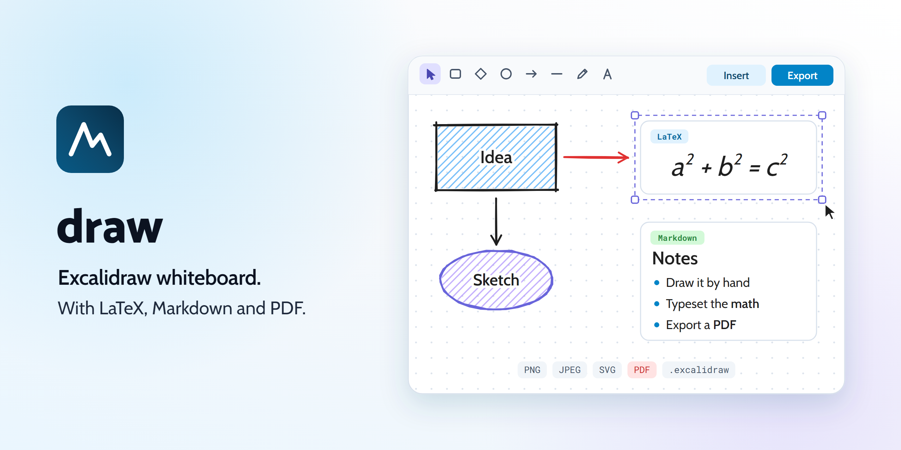
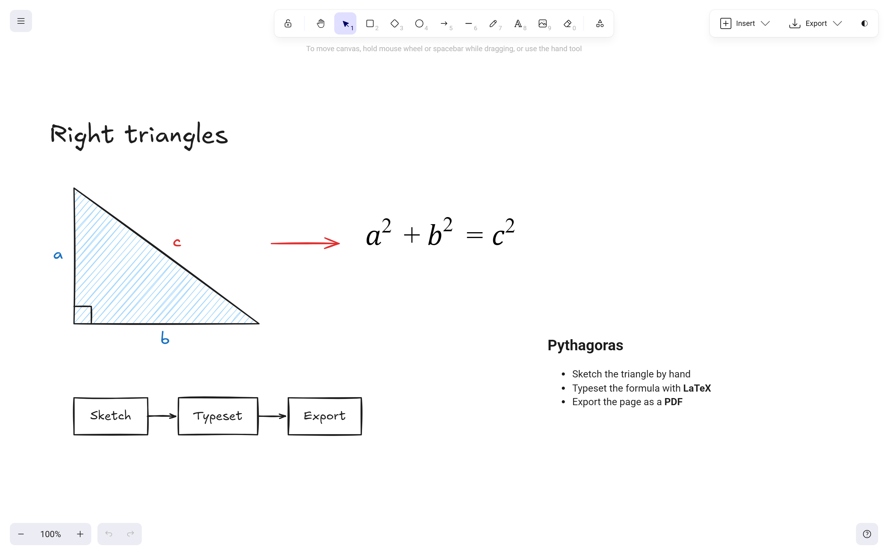
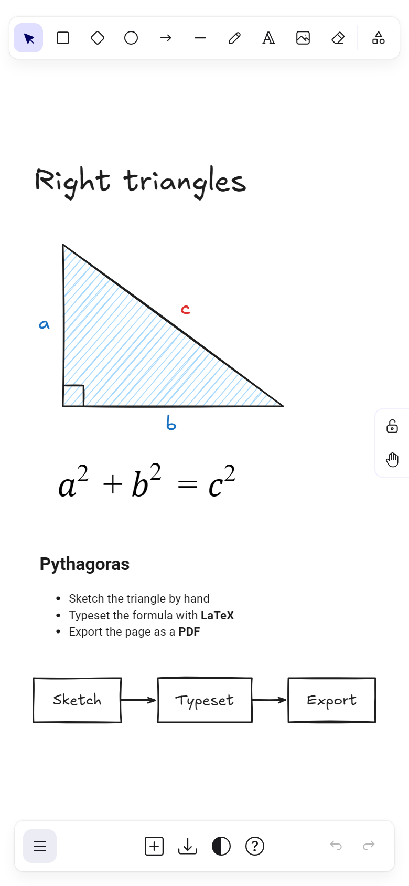

<a href="https://draw.marcopontili.com">
  <picture>
    <source media="(prefers-color-scheme: dark)" srcset=".github/brand/readme-dark.png">
    
  </picture>
</a>

# draw

[](https://github.com/marcop135/draw/actions/workflows/ci.yml)
[](./CHANGELOG.md)
[](https://github.com/excalidraw/excalidraw)
[](./LICENSE)

draw is the [Excalidraw](https://excalidraw.com) whiteboard with the three things a sketch usually needs next to it: typeset math, formatted notes, and a PDF of the result. It is a single static page at **[draw.marcopontili.com](https://draw.marcopontili.com)**: no account, no server, and it keeps working offline once installed.

## One board, start to finish

Sketch a right triangle with Excalidraw's hand-drawn tools. Open **Insert → LaTeX**, type `a^2 + b^2 = c^2`, and the formula lands on the canvas as a sharp image you can move and resize. Add a **Markdown** note with a heading and a list. Paste a Mermaid flowchart into Excalidraw's own Mermaid to Excalidraw and it becomes editable shapes. Then **Export** the board as a PDF, portrait, landscape, or whichever fits the drawing.

<a href="https://draw.marcopontili.com">
  <picture>
    <source media="(prefers-color-scheme: dark)" srcset="docs/readme/desktop-dark.png">
    
  </picture>
</a>

The theme follows the operating system and switches live when it does; the toolbar button cycles automatic → light → dark and remembers the choice. These screenshots follow your GitHub theme the same way. On a phone the board stacks into one column, with Insert, Export, theme and help in the bottom bar.

<p align="center">
  <picture>
    <source media="(prefers-color-scheme: dark)" srcset="docs/readme/mobile-dark.png">
    
  </picture>
</p>

## What draw adds to Excalidraw

The canvas, shapes, arrows, text, images, libraries, `.excalidraw` files and Mermaid to Excalidraw are Excalidraw's own. draw adds:

| Feature | What it does |
| --- | --- |
| **LaTeX** | KaTeX in strict mode, placed on the canvas as MathML inside an SVG, so it stays sharp at any zoom and in both themes. |
| **Markdown** | `marked` with GitHub-flavored syntax, sanitized by DOMPurify, placed as an image. |
| **Export menu** | PNG, JPEG, SVG, `.excalidraw`, copy PNG to the clipboard, and PDF in auto, portrait or landscape orientation. |
| **Automatic theme** | Follows `prefers-color-scheme` live; one button cycles automatic, light and dark. |
| **Autosave** | Saves the board to `localStorage` as you draw; on the next visit a chip offers to restore or discard it. |
| **Offline app** | Installable PWA; Workbox precaches the app shell and caches fonts and chunks as they load. |
| **Agent bridge** | Coding agents read and write the board through `window.draw` (see below). |

## Privacy and security

- **Local-first.** Drawings live in the browser's `localStorage`; clearing site data wipes them. Nothing is uploaded.
- **Sandboxed inserts.** KaTeX runs with `trust: false` and `strict: "error"`, Markdown goes through DOMPurify, and Mermaid is parsed into shapes rather than raw HTML.
- **Self-hosted.** Fonts and Excalidraw assets ship with the app; runtime never touches a CDN.
- **HTTP hardening.** CSP and related headers ship in `dist/.htaccess`.

Report vulnerabilities as described in [SECURITY.md](SECURITY.md).

## For agents

Agents open the live app in a browser and call `window.draw`:

| Method | Result |
| --- | --- |
| `getScene()` | Current board as `.excalidraw` JSON |
| `setScene(json)` | Replaces the board (up to 20 MB) and fits it to the view |
| `exportImage("png" \| "svg")` | PNG data URL or SVG string of the board |

The hamburger menu links to a "For agents" page; maintainer notes are in [docs/agent-surface.md](docs/agent-surface.md).

## Development

Requires Node 22 (`nvm use`).

```bash
npm ci
npm run dev      # http://localhost:5173
```

| Command | Purpose |
| --- | --- |
| `npm run dev` | Vite dev server on port 5173 |
| `npm run build` | Type-check and build to `dist/` |
| `npm run preview` | Serve `dist/` on port 4173 |
| `npm run lint` | ESLint, zero warnings |
| `npm test` | Vitest unit tests |
| `npm run test:e2e` | Playwright smoke tests |
| `npm run readme:shots` | Re-capture the README screenshots (needs `npm run preview`) |
| `npm run brand:images` | Render the README banner, GitHub social and OG images from `.github/brand/` (`brand:images:check` reports stale ones) |
| `npm run assets:brand` | Render favicons and app icons from `public/favicon*.svg` |
| `npm run verify:agent-readiness` | Check the agent discovery files in `dist/` |

## Project structure

| Path | Contents |
| --- | --- |
| `src/App.tsx` | The only screen: Excalidraw, the floating toolbar, autosave and restore |
| `src/components/` | Insert and Export menus, theme toggle, LaTeX and Markdown modals |
| `src/lib/` | Export, LaTeX, Markdown, theme, persistence, agent bridge |
| `public/` | Static assets, agent discovery files, Apache `.htaccess` |
| `docs/` | Agent surface notes and README screenshots |
| `e2e/` | Playwright smoke tests |
| `.github/brand/` | Banner, social and OG image sources |

## Built with

React 19, TypeScript, Vite, Excalidraw, KaTeX, marked, DOMPurify, jsPDF, and vite-plugin-pwa.

## Acknowledgements

Built on [Excalidraw](https://github.com/excalidraw/excalidraw) (MIT); thanks to the Excalidraw team for the editor. draw adds LaTeX and Markdown inserts, PDF and JPEG export, the automatic theme, autosave with restore, offline support, and the agent bridge.

## Contributing

Read [CONTRIBUTING.md](./CONTRIBUTING.md), then [report a bug](https://github.com/marcop135/draw/issues/new?template=01-bug-report.yml) or [request a feature](https://github.com/marcop135/draw/issues/new?template=02-feature-request.yml). Participation follows the [Code of Conduct](./CODE_OF_CONDUCT.md).

## Author

[Marco Pontili](https://marcopontili.com)

## License

[MIT](./LICENSE)
